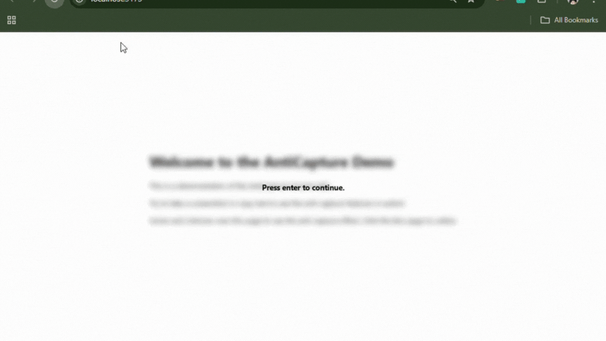

# React Anticapture



[](https://github.com/dimsp4/react-anticapture/actions/workflows/merge-jobs.yml)
[](https://github.com/dimsp4/react-anticapture/actions/workflows/pages.yml)
[](https://www.npmjs.com/package/react-anticapture)

A lightweight React component that helps prevent users from capturing (copying, selecting, or screenshotting) sensitive information rendered on your website.

---

## What is React Anticapture?

**React Anticapture** provides a simple `<AntiCapture>` component that you can wrap around any part of your React app to discourage or block screen capture, selection, and copying of sensitive content. It applies various browser techniques to reduce the risk of data leakage through screenshots, screen readers, copy-paste, and other client-side methods.

---

## Features

- Prevents text selection and copying inside wrapped content
- Applies CSS tricks to discourage screenshots (e.g., blur, overlays)
- Prevents right-click and context menu
- Lightweight and easy to use
- Works with any React project (TypeScript & JavaScript)

---

## Installation

```bash
pnpm add react-anticapture
# or
npm install react-anticapture
# or
yarn add react-anticapture
```

---

## Usage

Simply import and wrap any sensitive page within the `<AntiCapture>` component:

```jsx
import { AntiCapture } from 'react-anticapture';

function ConfidentialSection() {
  return (
    <AntiCapture>
      <h2>Confidential Information</h2>
      <p>
        This section contains sensitive information. Copying, selecting, and screenshots are discouraged.
      </p>
    </AntiCapture>
  );
}
```

---

## Props

| Prop               | Type               | Default | Description                                                                                      |
|--------------------|--------------------|---------|--------------------------------------------------------------------------------------------------|
| screenshotPrevent  | boolean            | true   | If true, prevents common screenshot and screen recording keyboard shortcuts.                      |
| userSelect         | boolean            | true   | If true, allows user text selection (turns on CSS `user-select`).                                |
| targetClick        | HTMLElement \| null|  null      | An optional HTMLElement to attach click listeners for dismissing blur. Defaults to the component's internal wrapper if not provided. |
| clipboardPrevent   | boolean            | false   | If true, prevents clipboard copy/paste actions and context menu inside the component.             |
| devtoolsPrevent    | boolean            | false   | If true, detects and prevents developer tools from being open.                                    |

---

## Limitations

- **No client-side solution can provide 100% protection** against screenshots or determined users. React Anticapture is intended to deter common capture attempts and raise the effort required.
- Not all browsers or extensions can be fully blocked.

---

## Demo

Try it out in Storybook: [Live Demo](https://dimsp4.github.io/react-anticapture/)

---

## License

MIT

---

Inspired by modern needs for client-side data privacy and protection.
